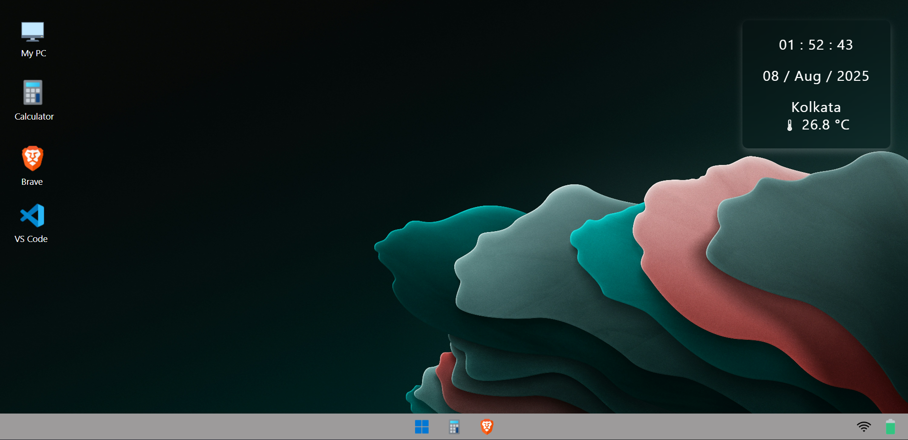

<h1 align="center">🖥️ Basic-Browser-based-OS</h1>

  
  
  
  

---

  <b>A lightweight browser-based desktop UI experience built with HTML, CSS, and JavaScript</b>  
  🧑‍💻 Designed to simulate a basic OS inside your browser.

---

  

---

## 🚀 Demo

---

## ✨ Features

- 🖥️ Desktop-like interface
- 📁 Clickable icons with app launch animation
- ⏰ Live clock and date display
- 🌐 Browser icon with Google search
- ⚙️ JavaScript-driven interactivity
- 💡 Responsive

---

## 🛠️ Built With

- HTML5
- CSS3 (Flexbox, Grid, Animation)
- JavaScript (Vanilla)

## 👨‍💻 Author

- Niloy Avro Mondal  
- GitHub: [@Niloy-Avro](https://github.com/Niloy-Avro)

---

## ⭐ Show Support

If you like this project, consider giving it a ⭐ on GitHub!  
Feel free to fork and make your own version 💡
